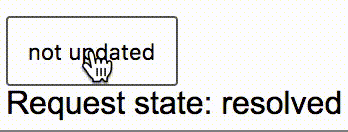

# react-optimistic

_A generic, optimistic update helper._

```jsx
import Optimistic from 'react-optimistic'

// ...

<Optimistic>
  {({ state, reqState, updater }) =>
    <div>
      <button
        className="optimistic-btn"
        onClick={updater(successfulAction)} // successfulAction returns a Promise
        >
        {state}
      </button>
      <br />
      Request state: {reqState}
    </div>
  }
</Optimistic>
```
A naive, optimistic button.



## Install

```
npm install react-optimistic
```

## API

- Optimistic : ReactComponent

  The Optimistic component takes a render prop with the following signature:
  ```typescript
  interface Args {
    state: string
    reqState: string
    updater: function
    reset: function
  }
  let renderProp: (args: Args) => ReactElement
  ```

  - props
    - children: renderProp
    - initialState : string

  **Example**
  ```jsx
    const Foo = ({ onClick }) =>
      <Optimistic>
        {({ state, updater }) => <button onClick={updater(onClick)}>{state}</button>}
      </Optimistic>
  ```
